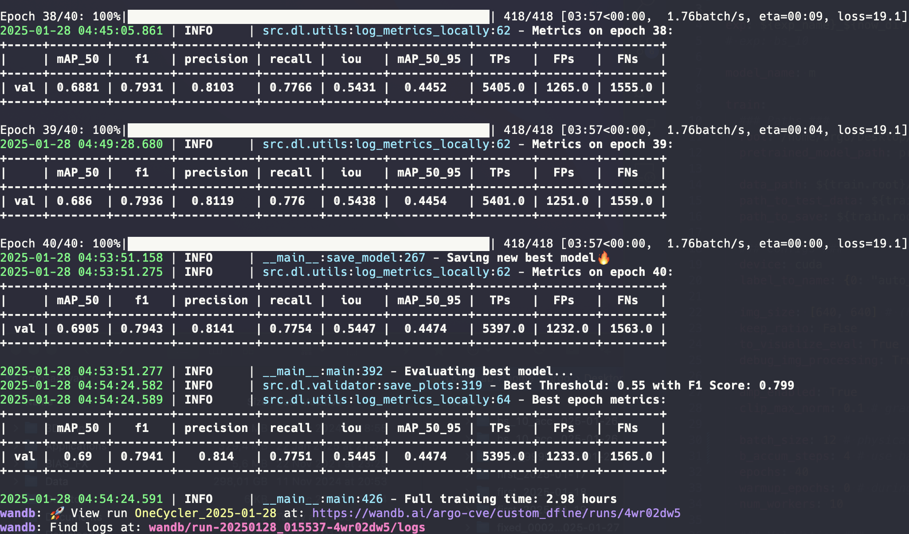
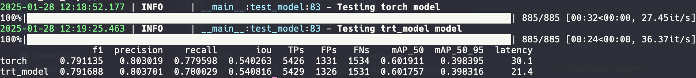
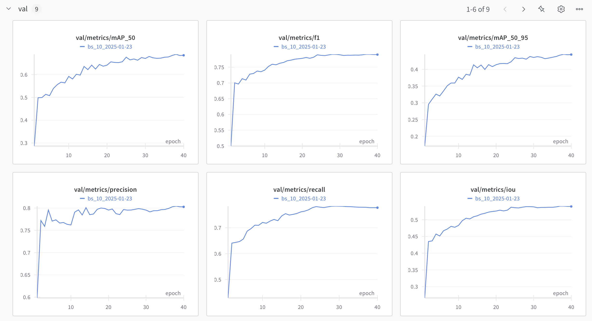

# Custom SoTA Object Detection D-FINE model training, exporting, inferencing pipeline
This is a custom project to work with [D-FINE](https://arxiv.org/abs/2410.13842) - state of the art object detection transformer based model. Model author's repo: [D-FINE](https://github.com/Peterande/D-FINE).

## Configuration
Check config.yaml for configs. Must specify:
- root
- pretrained_model_path
- data_path
- label_to_name

Common configs to change:
- exp_name
- model_name
- batch size
- epochs
- num_workers
- b_accum_steps


## Usage
To run the scripts, use the following commands:
```bash
python -m src.etl.preprocess    # Converts images and PDFs to JPG format
python -m src.etl.split         # Creates train, validation, and test CSVs with image paths
python -m src.dl.train          # Runs the training pipeline
python -m src.dl.export         # Exports weights in various formats after training
python -m src.dl.bench          # Runs all exported models on the test set
python -m src.dl.infer          # Runs model ontest folder, saves visualisations and txt preds
```

## Inference
Use inference classes in `src/infer`. Currently available:
- Torch
- TensorRT
- OpenVINO

## Outputs
- **Models**: Saved during the training process and export at `output/models/exp_name_date`. Includes training logs, table with main metrics, confusion matrics, f1-score_vs_threshold and precisino_recall_vs_threshold.
- **Debug images**: Preprocessed images (including augmentations) are saved at `output/debug_images/split` as they are fed into the model (except for normalization).
- **Evaluation predicts**: Visualised model's predictions on val set. Includes GT as green and preds as blue.
- **Bench images**: Visualised model's predictions with inference class. Uses all exported models
- **Infer**: Visualised model's predictions and predicted annotations in yolo txt format

## Results examples
**Train**



**Benchmarking**



**WandB**



**Infer**


## Features
- Training pipeline from SoTA D-FINE model
- Export to ONNX, OpenVino, TensorRT.
- Inference class for Torch, TensorRT, OpenVINO

- Augs based on the [albumentations](https://albumentations.ai) lib
- Mosaic augmentation
- Metrics: mAPs, Precision, Recall, F1-score, Confusion matrix, IoU, plots
- After training is done - runs a test to calculate the optimal conf threshold
- Exponential moving average model
- Batch accumulation
- Automatic mixed precision (40% less vRAM used and 15% faster training)
- Gradient clipping
- Keep ratio of the image and use paddings or use simple resize
- When ratio is kept, inference can be sped up with removal of grey paddings
- Visualisation of preprocessed images, model predictions and ground truth
- Warmup epochs to ignore background images for easier start of convirsion
- OneCycler used as scheduler, AdamW as optimizer
- Unified configuration file for all scrips
- Annotations in YOLO format, splits in csv format
- ETA displayed during training, precise strating epoch 2
- Logging file with training process
- WandB integration
- Batch inference

## TODO
- Implement multiscale aug
- Finetune with layers freeze
- Add support for cashing in dataset
- Add support for multi GPU training
- Instance segmentation
- Smart dataset preprocessing. Detect small objects. Detect near duplicates (remove from val/test)


## Acknowledgement
This project is built upon original [D-FINE repo](https://github.com/Peterande/D-FINE). Thank you to the D-FINE team for an awesome model!

``` bibtex
@misc{peng2024dfine,
      title={D-FINE: Redefine Regression Task in DETRs as Fine-grained Distribution Refinement},
      author={Yansong Peng and Hebei Li and Peixi Wu and Yueyi Zhang and Xiaoyan Sun and Feng Wu},
      year={2024},
      eprint={2410.13842},
      archivePrefix={arXiv},
      primaryClass={cs.CV}
}
```
